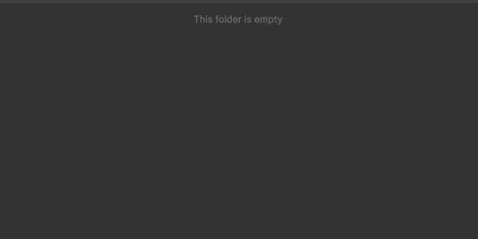
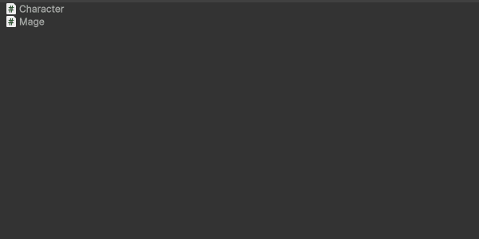

# Asset Templates

Utility for creating text assets from user-defined templates, whether they are scripts, data or any kind of serialized object.

All from a single menu: `Assets (or right-click in Project view) > Create > Create Asset From Template`

## Features

- Define template files for assets
- Trigger script generation as template
- Use template by name pattern (eg. add a suffix `-Component` to generate a component script)
- Use template by folder location
- Declare and set options for all the templates in your project

[=> See the built-in templates](./built-in-templates.md)

## Examples

Create components with utility attributes, and handle inheritance if applicable:

Create scriptable objects with utility attributes:

Create custom editors easily by just selecting the asset for which to create that editor:

## Documentation & Help

If you need help or just want to chat with the community and the *Sideways Experiments* core team, you're welcome to join our [Discord server](https://discord.gg/bMK2d47JaE)!

## Contributing

Do you want to get involved in our projects? Check our [general contributing guidelines](https://github.com/side-xp/docs/blob/main/shared/CONTRIBUTING.md) to learn more!

## License

This project is licensed under the [MIT License](https://mit-license.org).

---

Crafted and maintained with love by [Sideways Experiments](https://sideways-experiments.com)

(c) 2022-2025 Sideways Experiments