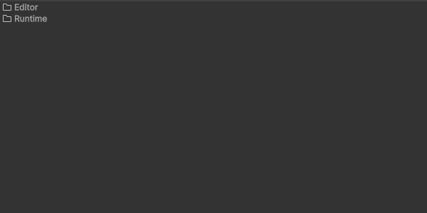
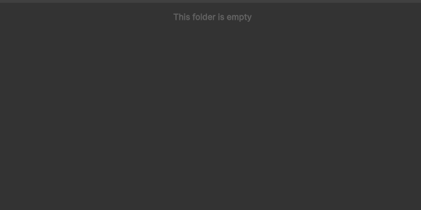
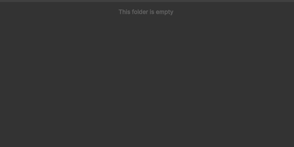
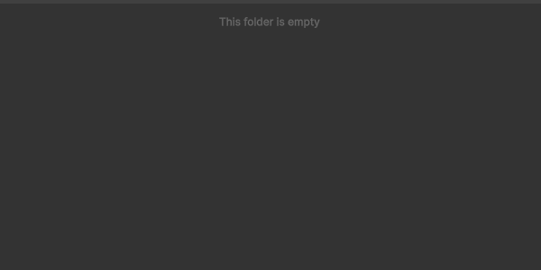
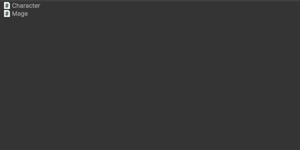
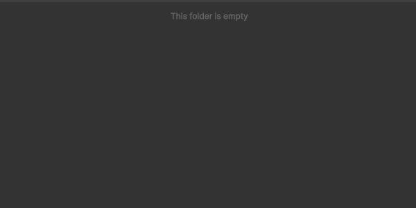
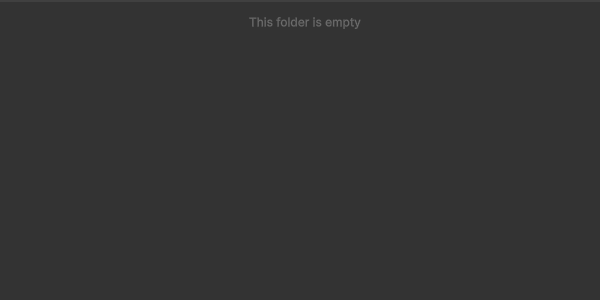
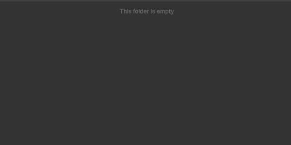
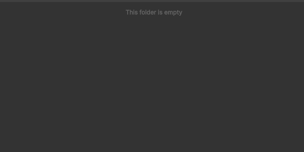

# Built-in Templates

This package already provides some asset templates ready to be used.

They are all enabled by default, and some of them may have specific options. You can disable them or edit their options from `Edit > Preferences > Sideways Experiments > Templates`.

## Quick Summary

- **`*.asmdef`**: Generates an Assembly Definition file
- **`-Atttribute`**: Generates a class that implments [`System.Attribute`](https://learn.microsoft.com/dotnet/api/system.attribute)
- **`class *`**: Generates a serializable native C# class
- **`struct *`**: Generates a serializable native C# struct
- **`comp *`** or **`-Component`**: Generates a script that implements [`MonoBehaviour`](https://docs.unity3d.com/ScriptReference/MonoBehaviour.html)
- ***Right-click on script* + `editor`**: Generates a custom editor script for the selected type
- **`-EditorWindow`**: Generates a custom editor window script
- **`enum *`** or **`E-`**: Generates an enumeration script
- **`flags *`** or **`F-`**: Generates an enumeration script with the [`[System.Flags]`](https://learn.microsoft.com/dotnet/api/system.flagsattribute) attribute
- **`I-`** *(followed by an uppercase letter)*: Generates an interface script
- ***Right-click on script or asset* + `json`**: Generates a JSON file that contains the serialized representation of the selected asset
- ***Right-click on script* + `drawer`**: Generates a custom property drawer script for the selected type
- **`-Asset`** or **`-SO`**: Generates a script that implements [`ScriptableObject`](https://docs.unity3d.com/ScriptReference/ScriptableObject.html)
- **`-Utility`** or **`-Helpers`**: Generates a static class script

## Assembly Definition

Generates an [Assembly Defnition](https://docs.unity3d.com/Manual/cus-asmdef.html) (`*.asmdef`) file, with basic configuration.



*Unity* uses the following conventions for naming Assembly Definitions:

```
<company-name>.<package-name>.asmdef
<company-name>.Unity.<package-name>.asmdef
<company-name>.Unity.<package-name>.Editor.asmdef
```

### Triggers

- The name of the file ends with `.asmdef`

### Special rules

If the name of the file ends with `Editor.asmdef`, the generated Assembly Definition will only include the *Editor* platform, making it editor-only.

If the *Setup Root Namespace* option is enabled, any `Unity` part in the name is removed, and `Editor` is replaced by `EditorOnly` to avoid conflicts with the [`Editor`](https://docs.unity3d.com/ScriptReference/Editor.html) class.

## Attribute

Generates a script that implements the [`System.Attribute`](https://learn.microsoft.com/dotnet/api/system.attribute) class.



### Triggers

- `-Attribute` suffix
- `-Attr` suffix

### Special rules

Whatever the trigger used, the final file and class names will always have the `-Attribute` suffix.

## Class / Struct

Generates a script for a native `class` or `struct`.



### Triggers

- `class-` prefix (followed by space or uppercase letter)
- `struct-` prefix (followed by space or uppercase letter)

### Special rules

If another script is selected or you right-clicked on a script when using the menu, the generated class will inherit from it if possible. This will also work with structs only if the parent script is an interface, as structs can't use inheritance in C#.

## Component

Generates a script that implements [`MonoBehaviour`](https://docs.unity3d.com/ScriptReference/MonoBehaviour.html).



### Triggers

- `comp-` prefix (followed by space or uppercase letter)
- `component-` prefix (followed by space or uppercase letter)
- `-Comp` suffix
- `-Component` suffix

### Special rules

If another script is selected or you right-clicked on a script when using the menu, the generated script will inherit from it only if that parent type also inherits from [`MonoBehaviour`](https://docs.unity3d.com/ScriptReference/MonoBehaviour.html). Otherwise, the script will ignore the parent type and inherit from [`MonoBehaviour`](https://docs.unity3d.com/ScriptReference/MonoBehaviour.html).

## Custom Editor

Generates a script that implements [`Editor`](https://docs.unity3d.com/ScriptReference/Editor.html), and use the [`[CustomEditor]`](https://docs.unity3d.com/ScriptReference/CustomEditor.html) attribute to create a custom editor for a specific object type.



### Triggers

- `editor-` prefix (followed by space or uppercase letter)
- `-Editor` suffix
- `editor` alone, with an [`Object`](https://docs.unity3d.com/ScriptReference/Object.html) or custom attribute script selected

### Special rules

The output file and class name will always have the `-Editor` suffix.

Also, if the initial path is not inside an `Editor/` folder, that folder will be automatically created, and the new asset will be placed inside it. This is to prevent you from creating editor-only features that are not included in a build.

## Editor Window

Generates a script that implements [`EditorWindow`](https://docs.unity3d.com/ScriptReference/EditorWindow.html).



### Triggers

- `window-` prefix (followed by space or uppercase letter)
- `-EditorWindow` suffix

### Special rules

The output file and class name will always have the `-EditorWindow` suffix.

Also, if the initial path is not inside an `Editor/` folder, that folder will be automatically created, and the new asset will be placed inside it. This is to prevent you from creating editor-only features that are not included in a build.

## Enum / Flags

Generates a script that declares an enumeration, and optionally use the [`[System.Flags]`](https://learn.microsoft.com/dotnet/api/system.flagsattribute) attribute.



### Triggers

- `E-` prefix (followed by space or uppercase letter)
- `enum-` prefix (followed by space or uppercase letter)
- `-Enum` suffix
- `F-` prefix (followed by space or uppercase letter)
- `flags-` prefix (followed by space or uppercase letter)
- `-Flags` suffix

## Interface

Generates a script that declares an interface.


### Triggers

- `I-` prefix (followed by space or uppercase letter)
- `interface-` prefix (followed by space or uppercase letter)
- `-Interface` suffix

### Special rules

If another script is selected or you right-clicked on a script when using the menu, the generated script will inherit from it only if that parent type is also an interface.

## JSON

Generates a JSON (`*.json`) file.



### Triggers

- File extension is `*.json`
- `json` alone, with a [`ScriptableObject`](https://docs.unity3d.com/ScriptReference/ScriptableObject.html) or [serializable](https://learn.microsoft.com/dotnet/api/system.serializableattribute) class script selected, or with any asset but a script selected

### Special rules

When using the `json` shortcut with an object selected:

- If the selected object is an asset that is not a script, the output file will contain the serialized JSON representation of that asset
- If the selected object is a script asset, the asset template will try to create an instance of it, serialize it as JSON, and put that JSON as content of the output file

## MarkDown

Generates an empty *MarkDown* file (`*.md`).

### Triggers

- File extension is `*.md`

## Package Manifest

Generates a `package.json` file to declare a *Unity* package with basic configuration.

### Triggers

- The name of the file is exactly `package.json`

## Custom Property Drawer

Generates a script that implements [`PropertyDrawer`](https://docs.unity3d.com/ScriptReference/PropertyDrawer.html), and use the [`[CustomPropertyDrawer]`](https://docs.unity3d.com/ScriptReference/CustomPropertyDrawer.html) attribute to create a custom property drawer for a specific property or attribute type.



### Triggers

- `drawer-` prefix (followed by space or uppercase letter)
- `-PropertyDrawer` suffix
- `drawer` alone, with an [`Object`](https://docs.unity3d.com/ScriptReference/Object.html), [`PropertyAttribute`](https://docs.unity3d.com/ScriptReference/PropertyAttribute.html) or [serializable](https://learn.microsoft.com/dotnet/api/system.serializableattribute) class script selected

### Special rules

The output file and class name will always have the `-PropertyDrawer` suffix.

Also, if the initial path is not inside an `Editor/` folder, that folder will be automatically created, and the new asset will be placed inside it. This is to prevent you from creating editor-only features that are not included in a build.

## Scriptable Object

Generates a script that implements [`ScriptableObject`](https://docs.unity3d.com/ScriptReference/ScriptableObject.html).


### Triggers

- `scriptable-` prefix (followed by space or uppercase letter)
- `asset-` prefix (followed by space or uppercase letter)
- `-ScriptableObject` suffix
- `-Scriptable` suffix
- `-SO` suffix
- `-Asset` suffix

### Special rules

If another script is selected or you right-clicked on a script when using the menu, the generated script will inherit from it only if that parent type also inherits from [`ScriptableObject`](https://docs.unity3d.com/ScriptReference/ScriptableObject.html). Otherwise, the script will ignore the parent type and inherit from [`ScriptableObject`](https://docs.unity3d.com/ScriptReference/ScriptableObject.html).

## Text

Generates an empty text file (`*.txt`).

### Triggers

- File extension is `*.txt`

## Utility class

Generates a script that declares a `static` class, meant to define helper functions or extensions.


### Triggers

- `utility-` prefix (followed by space or uppercase letter)
- `utilities-` prefix (followed by space or uppercase letter)
- `helper-` prefix (followed by space or uppercase letter)
- `helpers-` prefix (followed by space or uppercase letter)
- `extension-` prefix (followed by space or uppercase letter)
- `extensions-` prefix (followed by space or uppercase letter)
- `-Utility` suffix
- `-Utilities` suffix
- `-Helper` suffix
- `-Helpers` suffix
- `-Extension` suffix
- `-Extensions` suffix